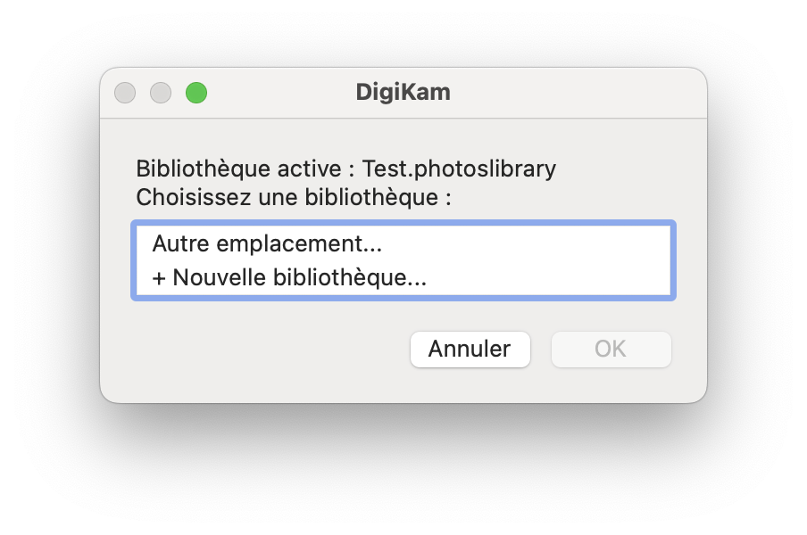

# DigiKam Switch

**DigiKam Switch** is a multiple library manager for [DigiKam](https://www.digikam.org/), available on macOS and Linux.

DigiKam does not natively support multiple photo libraries (unlike Apple Photos). DigiKam Switch fills this gap with a simple graphical interface: choose the active library, create a new one, or locate an existing one — then launch DigiKam directly.



---

## Features

- Lists available DigiKam libraries with the active one clearly marked
- Switch to an existing library in one click
- Create a new library from a template
- Locate an unlisted library via a file picker
- Fully localized in 14 languages: French, English, Spanish, Italian, German, Portuguese, Dutch, Polish, Ukrainian, Russian, Japanese, Simplified Chinese, Korean
- Compatible with macOS 10.9+ and Linux (KDE, GNOME, XFCE and others)

---

## Repository structure

```
digikam-switch/
├── README.md
├── Screenshot.png
├── digikam_template.zip          ← Empty DigiKam SQLite database (shared macOS/Linux)
├── icons/
│   ├── DigikamSwitch.svg         ← Application icon
│   ├── DigikamLibrary.svg        ← .digikamlibrary type icon
│   ├── DigikamLibrary.png        ← 512px PNG (source for iconset)
│   ├── DigiKamLibrary.iconset/   ← Generated by make_icns.sh
│   └── DigiKamLibrary.icns       ← Generated by make_icns.sh
├── macos/
│   ├── digikam_switch.sh         ← Main script
│   ├── Info.plist                ← Merged Platypus + UTI .digikamlibrary
│   ├── make_icns.sh              ← SVG → PNG 1024 → iconset → .icns
│   ├── build_app.sh              ← Post-Platypus: patch Info.plist + copy icns
│   ├── Digikam Switch.platypus   ← Platypus project file
│   └── screenshots/
│       └── platypus_config.png
└── linux/
    ├── digikam_switch_linux.sh   ← Main script
    ├── digikam-switch.desktop    ← Application menu entry
    ├── org.digikam.library.xml   ← MIME type declaration
    ├── install.sh                ← Installation script
    └── build_deb.sh              ← Debian package builder
```

---

## The `.digikamlibrary` format

DigiKam Switch creates and manages libraries as `.digikamlibrary` packages — a folder whose extension signals to macOS that it should be treated as an opaque bundle (similar to `.app` or `.bundle`). Benefits:

- On macOS, Finder hides the internal contents, preventing accidental manipulation of SQLite databases
- The `.digikamlibrary` extension is registered as a custom UTI with its own icon
- On Linux, the extension works as any regular folder — it has no special meaning for the system, but keeps things consistent across platforms

**Any folder containing a `digikam4.db` file is recognized**, regardless of its extension. Existing DigiKam libraries in plain folders are supported via **Other location...** in the interface.

---

## macOS

### Requirements

- macOS 10.9 Mavericks or later
- [DigiKam](https://www.digikam.org/download/) installed at `/Applications/digiKam.org/digikam.app`
- [Platypus](https://sveinbjorn.org/platypus) to package the script as a `.app`
- [ImageMagick](https://imagemagick.org/) (via MacPorts: `sudo port install ImageMagick`) for icon generation

### Step 1 — Generate the icon

```bash
bash macos/make_icns.sh
```

This converts `icons/DigikamLibrary.svg` to a full `DigiKamLibrary.icns` file via ImageMagick + sips + iconutil.

### Step 2 — Package with Platypus

Open `macos/Digikam Switch.platypus` in Platypus, verify that `digikam_template.zip` is listed in **Bundled Files**, then click **Create App**.

Platypus settings:

| Setting | Value |
|---------|-------|
| Script Type | bash |
| Script Path | `macos/digikam_switch.sh` |
| Interface | None |
| Run in background | ✓ |
| Remain running after completion | ✗ |
| Bundled Files | `digikam_template.zip` |
| App Name | Digikam Switch |


### Step 3 — Post-process the app

```bash
bash macos/build_app.sh "/path/to/Digikam Switch.app"
```

This replaces `Info.plist` with the UTI-aware version and copies `DigiKamLibrary.icns` into the bundle so Finder displays the correct icon for `.digikamlibrary` folders.

### Detected library folders

The script scans the following locations for `.digikamlibrary` folders containing a `digikam4.db`:

- `~/Pictures/Digikam/`
- `~/Pictures/`

Libraries elsewhere are accessible via **Other location...**.

---

## Linux

### Requirements

- DigiKam installed and available as the `digikam` command
- `kdialog` (KDE) or `zenity` (GNOME/GTK) for the graphical interface
- `unzip` for template extraction

### Installation

```bash
git clone https://github.com/M-Rick/digikam-switch.git
cd digikam-switch
sudo bash linux/install.sh
```

Installs:
- `digikam_switch_linux.sh` → `/usr/local/bin/`
- `digikam_template.zip` → `/usr/local/share/digikam-switch/`
- `digikam-switch.desktop` → `~/.local/share/applications/`
- `org.digikam.library.xml` → `/usr/share/mime/packages/`
- `DigikamSwitch.svg` → `/usr/share/icons/hicolor/scalable/apps/`
- `DigikamLibrary.svg` → `/usr/share/icons/hicolor/scalable/mimetypes/`

### Build the Debian package

```bash
bash linux/build_deb.sh
```

Generates `linux/digikam-switch_1.0.0_all.deb`.

### Graphical interface detection

1. **kdialog** if desktop is KDE or LXQt and kdialog is installed
2. **zenity** if available
3. **kdialog** on any other Qt desktop
4. **Text** fallback in terminal

### Detected library folders

- `~/.local/share/digikam/`
- `~/Pictures/`

---

## digikam_template.zip

Contains an empty initialized DigiKam database (`digikam4.db`, `recognition.db`, `similarity.db`, `thumbnails-digikam.db`) used as a base when creating new libraries. Common to both macOS and Linux.

To regenerate it from a clean DigiKam installation:

```bash
mkdir -p /tmp/Digikam.digikamlibrary
digikam --database-directory /tmp/Digikam.digikamlibrary
# Quit DigiKam as soon as it launches
cd /tmp
zip digikam_template.zip Digikam.digikamlibrary/*.db
```

---

## License

GPL v3 — in the spirit of the DigiKam project.


